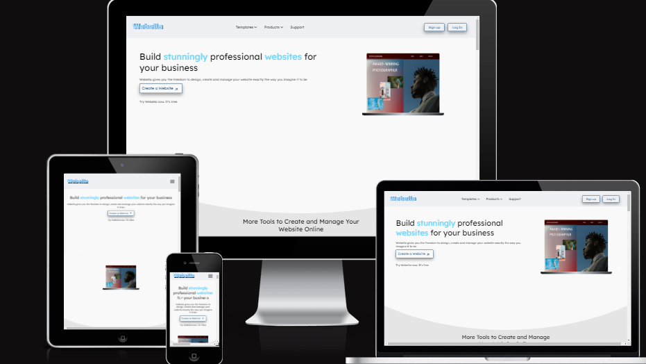

# my_cms_team_11 (Webella)

> We are building a platform that allows users to spin up a basic website



## Built With

- Html,
- Css,
- Javascript,
- Python
- Hosted with github pages

## Live Demo

[Live Demo Link](https://zuri-training.github.io/my_cms_team_11/)

### Development (Running locally)

- Clone the project

```bash
git clone https://github.com/zuri-training/my_cms_team_11.git

## Style Guides

- [CSS Style Guide](http://udacity.github.io/frontend-nanodegree-styleguide/css.html)
- [HTML Style Guide](http://udacity.github.io/frontend-nanodegree-styleguide/index.html)
- [JavaScript Style Guide](http://udacity.github.io/frontend-nanodegree-styleguide/javascript.html)
- [Git Style Guide](https://udacity.github.io/git-styleguide/)
- [Python Style Guide](https://peps.python.org/pep-0008/)

##Figma link to the Hi-Fi, Low-Fi, and style guides: https://www.figma.com/file/Pl2xy3VVA3gfvvoh7pklqT/Project-my_cms-team-library


## 🤝 Contributing

Contributions, issues and feature requests are welcome!

Feel free to check the [issues page](../../issues).

## Show your support

Give a ⭐️ if you like this project!

## 📝 License

[MIT licensed](./LICENSE).
```
